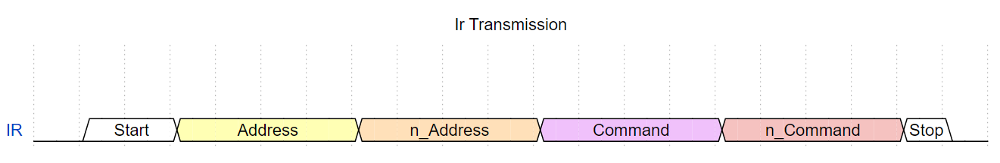

# Zumo32u4IRsender
Simple Arduino library for sending [NEC protocol](https://www.digikey.com/en/maker/tutorials/2021/understanding-the-basics-of-infrared-communications) IR messages from a Zumo32u4 robot.

The library uses the robots built in IR LED normally used for proximity sensing. Due to this, it is not possible to use the library and the proximity sensing at the same time, but they should be usable in alternation.

The library is written to be compatible with the [Iremote library](https://github.com/Arduino-IRremote/Arduino-IRremote) and is suggested to be used together with it. If used together with the Iremote library, the IRemote shuld be set to use pin 22 as IR receiver pin as this is the pin for the front proximity sensor.

## Usage
The library is used by including the header file and creating an instance of the Zumo32u4IRsender class. The constructor takes arguments for the device ID and the side of the robot the IR LED is on. The device ID is used to identify the robot and is sent with every message. The side argument is used to determine the direction of the IR LEDs used.

If neaded, the device ID can be changed by calling the setDeviceId function, and the side can be changed by calling the setDirection function.

For sending of IR messaged the function send is used. It takes a single argument, the message byte to be sent. This byte then gets sent along with the device ID in a NEC protocol message.

Both the device ID and the message are max 8 bits (0-255)



## Functions
```cpp
// direction: 0 => right side, 1 => left side
Zumo32U4IRsender ZumoIrSender(DEVICE_ID, 0);
```
```cpp
  ZumoIrSender.setDeviceId(DEVICE_ID)
```
```cpp
// direction: 0 => right side, 1 => left side
ZumoIrSender.setDirection(0)
```
```cpp
ZumoIrSender.send(0x11);
```

## Example
```cpp
#include <Zumo32u4IRsender.h>

#define DEVICE_ID 0x01
#define DIRECTION 0

Zumo32U4IRsender ZumoIrSender(DEVICE_ID, DIRECTION);

void setup() {
}

void loop() {
  ZumoIrSender.send(0x11);
  delay(1000);
}
```

